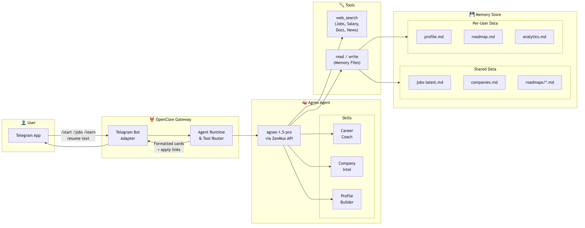
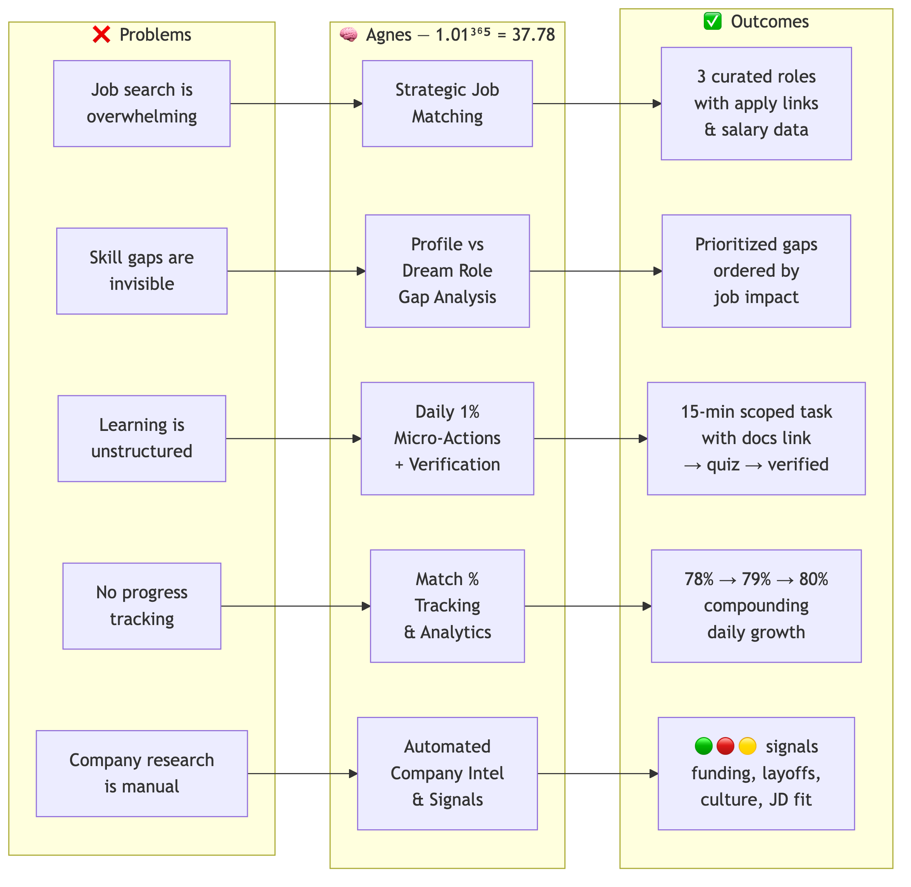

# Agent 37 Career Coach

> Every other agent helps you apply to more jobs. Agent 37 makes you qualified for better ones.

Agent 37 is an AI career intelligence agent that scans the market, finds strategic roles, identifies exactly what you're missing, and gives you one 15-minute action every day to close the gap — then verifies you actually learned it.

**1.01^365 = 37.78** — 1% better every day compounds to 37x in a year.



## Features

- **Strategic Job Matching** — Curates 3 high-signal roles (not 200 keyword matches) with apply links, salary estimates, and company signals
- **Gap Analysis** — Compares your profile against dream roles and prioritizes gaps by job impact
- **Daily 1% Micro-Actions** — Hyper-scoped 15-minute learning tasks with specific doc sections, stopping points, and resource links
- **Verified Learning** — Quiz after each action; progress only counts when confirmed
- **Company Intel** — Funding signals, layoff alerts, culture data, and JD-to-profile matching
- **Match % Tracking** — Watch your qualification score compound over time



## How It Works

Agent 37 runs on [OpenClaw](https://openclaw.ai), an open-source AI agent framework, and is accessible via Telegram. The agent uses the Agnes Claw Model (`sapiens-ai/agnes-1.5-pro`) via the ZenMux API.

**Telegram commands:**
| Command | Description |
|---------|-------------|
| `/start` | Meet Agent 37 |
| `/profile` | Build or update your career profile |
| `/jobs` | See top 3 job matches with apply links |
| `/learn` | Get today's 1% growth action |
| `/progress` | View your match % and analytics |
| `/company <name>` | Get intel on a specific company |

**User flow:**
1. Send your resume or background → Agent 37 builds your profile, shows 3 strategic jobs, identifies gaps, and assigns your first micro-action
2. Complete the 15-min action → Reply to Agent 37 → it sends a verification question
3. Pass verification → Match % goes up, next action assigned
4. Repeat daily — gaps close, new jobs enter your range, you compound

## Project Structure

```
agnes-career-coach/
├── workspace/
│   ├── AGENTS.md              # Operating guidelines and output templates
│   ├── SOUL.md                # Agent identity and personality
│   ├── TOOLS.md               # Tool usage documentation
│   ├── IDENTITY.md            # Agent metadata
│   ├── BOOTSTRAP.md           # First-run onboarding flow
│   ├── HEARTBEAT.md           # Health check
│   ├── skills/
│   │   ├── career-coach/      # Daily micro-action generation + verification
│   │   ├── profile-builder/   # Resume parsing + gap analysis
│   │   ├── job-scanner/       # Strategic job search + categorization
│   │   ├── salary-intel/      # Salary inference via US pay transparency
│   │   ├── company-intel/     # Company signals (funding, layoffs, culture)
│   │   └── analytics/         # Match % tracking + progress reports
│   └── memory/
│       └── shared/            # Shared data (job listings, roadmaps)
│           ├── jobs-latest.md
│           ├── companies.md
│           └── roadmaps/      # Skill trees from roadmap.sh
├── config/
│   └── openclaw.example.json  # Gateway config template (add your keys)
├── diagrams/
│   ├── architecture.mmd       # System architecture (Mermaid)
│   ├── architecture.png
│   ├── problem-solution.mmd   # Problem → Solution → Outcome (Mermaid)
│   └── problem-solution.png
└── README.md
```

## Setup

### Prerequisites

- [Node.js](https://nodejs.org/) v22+
- [OpenClaw](https://openclaw.ai) v2026.4.2+
- A Telegram bot token (from [@BotFather](https://t.me/BotFather))
- A ZenMux API key for the Agnes Claw Model

### Installation

1. **Install OpenClaw:**
   ```bash
   npm install -g openclaw@latest
   openclaw onboard --install-daemon
   ```

2. **Configure the gateway:**
   ```bash
   cp config/openclaw.example.json ~/.openclaw/openclaw.json
   ```
   Edit `~/.openclaw/openclaw.json` and fill in:
   - `channels.telegram.botToken` — your Telegram bot token
   - `models.providers.custom-zenmux-ai.apiKey` — your ZenMux API key
   - `agents.defaults.workspace` — absolute path to the `workspace/` directory

3. **Start the gateway:**
   ```bash
   openclaw gateway restart
   openclaw gateway status   # verify it's running
   ```

4. **Test it:**
   ```bash
   openclaw agent --message "/start" --agent main
   ```
   Or message your Telegram bot directly.

## Skills

Each skill is a prompt file (`SKILL.md`) that defines when and how the agent performs a specific capability.

| Skill | Purpose |
|-------|---------|
| **career-coach** | Generates daily 1% micro-actions, handles verification quizzes, manages the learning roadmap |
| **profile-builder** | Extracts structured career profiles from resumes, calculates match %, tracks time-per-stack |
| **job-scanner** | Searches for strategic job matches, categorizes by fit (>85% strong, 70-85% stretch) |
| **salary-intel** | Infers compensation by cross-referencing US pay transparency data |
| **company-intel** | Gathers company health signals — funding, layoffs, hiring velocity, Glassdoor, career page JDs |
| **analytics** | Tracks match % trend, skills verified, streaks, and generates progress reports |

## Built With

- [OpenClaw](https://openclaw.ai) — AI agent framework with Telegram integration
- [Agnes Claw Model](https://zenmux.ai) (`sapiens-ai/agnes-1.5-pro`) — LLM via ZenMux API
- [Telegram Bot API](https://core.telegram.org/bots/api) — User interface
- Skill roadmaps sourced from [roadmap.sh](https://roadmap.sh)

## Team

**Sapiens AI** — Built for the OpenClaw Hackathon 2026, Track 3 (Open Innovation).

## License

[MIT](LICENSE)
